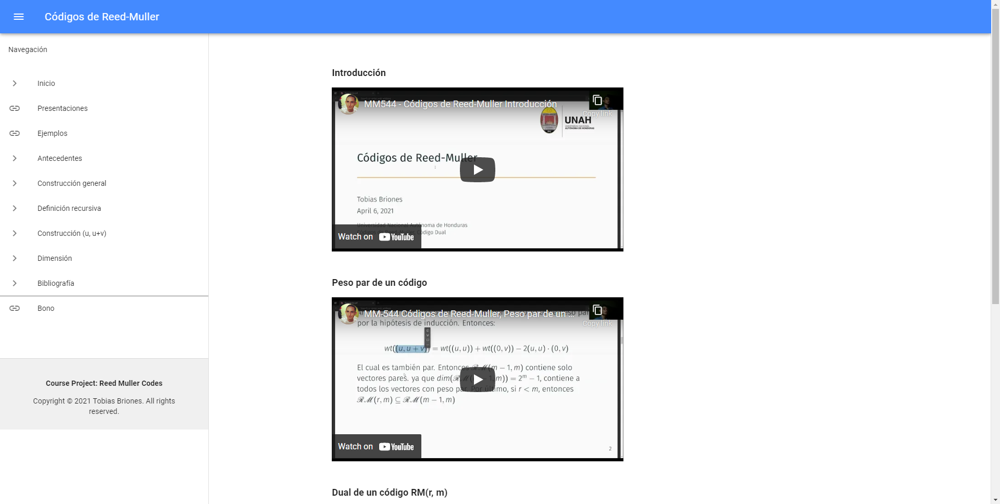
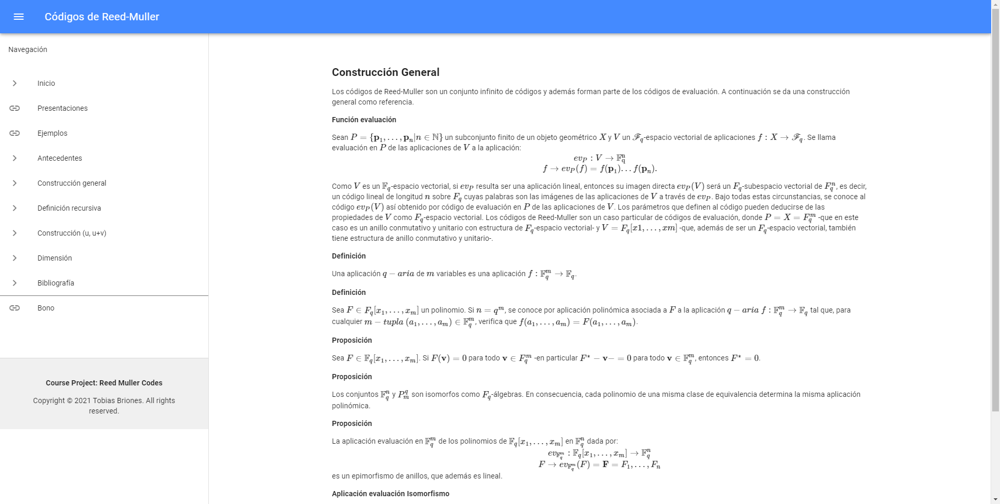
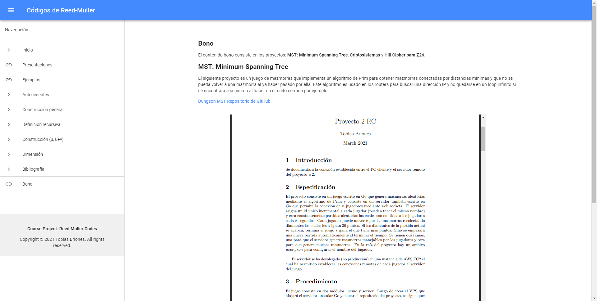

# Course Project at UNAH-MM544: Reed Muller Codes

[](https://github.com/tobiasbriones/cp-unah-mm544-reed-muller-codes)

[](https://github.com/tobiasbriones/cp-unah-mm544-reed-muller-codes/blob/main/LICENSE)

Website containing information and resources about Reed-Muller Codes.

## Instructions

Make a paper about your topic and take your information in LaTeX format to a website along with
other resources provided by you like videos, proofs, or code examples.

## Getting started

Project setup:

```
npm install
```

Run on development mode:

```
npm run serve
```

Build for production:

```
npm run build
```

Checkout [vue.config.js](./vue.config.js) if needed.

## Screenshots








## Contact

This project: [Website](https://tobiasbriones.github.io/cp-unah-mm544-reed-muller-codes),
[Repository](https://github.com/tobiasbriones/cp-unah-mm544-reed-muller-codes)

Tobias Briones: [GitHub](https://github.com/tobiasbriones)

## About

**Course Project at UNAH-MM544: Reed Muller Codes**

Website containing information and resources about Reed-Muller Codes.

Copyright © 2021 Tobias Briones. All rights reserved.

### License

This project is licensed under the [BSD 3-Clause License](LICENSE).

---

- This project contains theoretical content from other sources. See
  the [BIBLIOGRAPHY.md](BIBLIOGRAPHY.md) file for more details.
